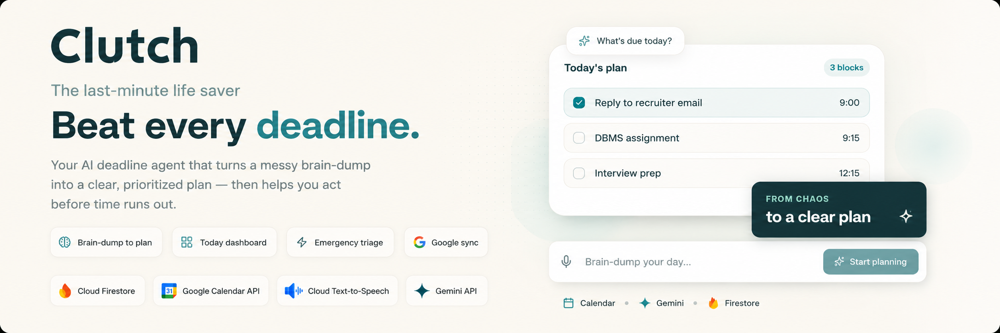
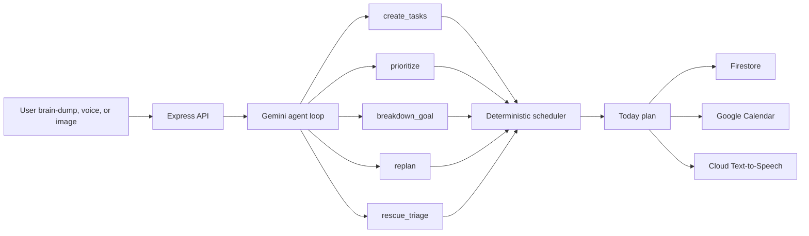

<div align="center">



# Clutch

### The Last-Minute Life Saver

Clutch is an AI productivity companion that turns a chaotic brain-dump into a prioritized, time-blocked, action-ready plan before deadlines slip.

[](https://clutch-433410067334.asia-south1.run.app/)
[](https://react.dev/)
[](https://www.typescriptlang.org/)
[](https://ai.google.dev/)
[](./LICENSE)

Built by **Parthiv A M** for **Vibe2Ship 2026** by Coding Ninjas 10X Club x Google for Developers.

[Live App](https://clutch-433410067334.asia-south1.run.app/) | [Submission Notes](./SUBMISSION.md) | [Deployment Guide](./DEPLOYMENT.md)

</div>

---

## Table of Contents

- [Why Clutch](#why-clutch)
- [What It Does](#what-it-does)
- [Agentic Workflow](#agentic-workflow)
- [Key Features](#key-features)
- [Google Technologies](#google-technologies)
- [Tech Stack](#tech-stack)
- [Architecture](#architecture)
- [Local Development](#local-development)
- [Deployment](#deployment)
- [Security Notes](#security-notes)
- [Demo Flow](#demo-flow)
- [Project Structure](#project-structure)
- [License](#license)

## Why Clutch

Most productivity tools remind users that a deadline exists. That is useful, but it does not answer the harder question:

> What should I do right now, with the time and energy I actually have left?

Clutch is built for that moment. It helps students, professionals, founders, and makers turn scattered tasks into a concrete plan. It can parse messy input, prioritize work, protect fixed commitments, break down large goals, rebuild the timeline, and run an emergency rescue mode when the day starts falling apart.

## What It Does

Clutch accepts plain text, voice input, or an image of a task list. It then:

1. Extracts structured tasks from messy input.
2. Ranks them into `NOW`, `NEXT`, and `LATER`.
3. Builds a realistic time-blocked Today plan.
4. Preserves fixed-time commitments like "gym from 6 PM to 8 PM".
5. Breaks large tasks into smaller subtasks.
6. Syncs the generated plan to Google Calendar.
7. Speaks rescue and planning summaries aloud.
8. Persists user state with Firestore.

## Agentic Workflow

Clutch is more than a prompt-to-text wrapper. The backend runs a Gemini function-calling loop where the model chooses tools, the server applies those actions, and the updated state is fed back into the next reasoning step.



### Agent Tools

| Tool | Purpose |
| --- | --- |
| `create_tasks` | Converts text, voice, or image brain-dumps into structured tasks. |
| `prioritize` | Ranks work into `NOW`, `NEXT`, and `LATER` with short reasons. |
| `breakdown_goal` | Splits large goals into ordered, smaller subtasks. |
| `replan` | Rebuilds the plan when tasks change, move, drop, or complete. |
| `rescue_triage` | Powers Clutch Mode, the emergency "what do I do now?" workflow. |

After the AI step, a deterministic scheduler creates the final timeline. This keeps the plan reliable: fixed commitments stay fixed, overlapping blocks are resolved, peak-energy windows are respected, and generated subtasks stay inside the intended time slot.

## Key Features

- **Brain-dump planning**: Type one messy paragraph and Clutch turns it into structured tasks.
- **Voice capture**: Dictate tasks directly into the planner.
- **Image-to-task support**: Upload a photo of a handwritten or whiteboard task list using Gemini Vision.
- **NOW / NEXT / LATER prioritization**: See what matters immediately and what can wait.
- **Time-blocked Today plan**: Convert priorities into a schedule with start and end times.
- **Fixed commitment protection**: Handles tasks like "interview at 3 PM" or "gym 6 PM to 8 PM".
- **Goal breakdown**: Split large tasks into smaller steps without destroying the existing timeline.
- **Clutch Mode**: Emergency triage for overwhelmed moments.
- **Agent voice**: Spoken plan and rescue summaries via Cloud Text-to-Speech.
- **Google Calendar sync**: Add generated schedule blocks to Calendar.
- **Firestore persistence**: Tasks, schedule, settings, archive, and activity survive reloads.
- **Agent Activity feed**: Shows what the agent just did so the experience feels transparent.
- **Responsive dashboard**: Desktop, laptop, tablet, and mobile-friendly interface.

## Google Technologies

| Google technology | How Clutch uses it |
| --- | --- |
| Google AI Studio | Gemini API setup, model testing, and rapid AI iteration. |
| Gemini API | Agent reasoning, task extraction, prioritization, replanning, and rescue mode. |
| Gemini Vision | Reads task lists from uploaded images. |
| Google Cloud Run | Hosts the deployed full-stack application. |
| Cloud Build | Builds and deploys the app from source. |
| Artifact Registry | Stores Cloud Run container images. |
| Secret Manager | Stores the Gemini API key outside source code. |
| Firestore | Persists user state, settings, archive, tasks, and schedules. |
| Cloud Text-to-Speech | Speaks plan summaries and Clutch Mode responses. |
| Google Calendar API | Adds generated plan blocks to the user's calendar. |
| Google Fonts | Provides polished typography across the app. |

## Tech Stack

| Layer | Stack |
| --- | --- |
| Frontend | React 19, TypeScript, Vite, Tailwind CSS v4, Motion, lucide-react, date-fns |
| Backend | Node.js, Express, TypeScript, esbuild |
| AI | `@google/genai`, Gemini 2.5 Flash |
| Cloud | Cloud Run, Cloud Build, Artifact Registry, Secret Manager, Firestore, Cloud Text-to-Speech, Calendar API |

## Architecture

```text
Browser
  |
  | React dashboard, landing page, Google OAuth, speech input
  v
Express server on Cloud Run
  |
  | /api/agent       -> Gemini function-calling loop
  | /api/tts         -> Cloud Text-to-Speech audio
  | /api/state/*     -> Firestore persistence
  | /api/config      -> runtime Calendar OAuth config
  v
Google Cloud services
  |
  | Gemini API, Firestore, Secret Manager, Cloud TTS, Calendar API
```

## Local Development

### Prerequisites

- Node.js 20+
- npm
- Gemini API key
- Optional: Google OAuth Client ID for Calendar sync
- Optional: Google Cloud credentials for Firestore and Cloud Text-to-Speech locally

### Install

```bash
git clone https://github.com/Paaarthiv/clutch--The-Last-Minute-Life-Saver-.git
cd clutch--The-Last-Minute-Life-Saver-
npm install
```

### Configure environment

Create `.env.local`:

```bash
GEMINI_API_KEY=your_gemini_api_key
GEMINI_MODEL=gemini-2.5-flash
GOOGLE_CALENDAR_CLIENT_ID=your_google_oauth_client_id
VITE_GOOGLE_CLIENT_ID=your_google_oauth_client_id
APP_URL=http://localhost:3000
```

### Run

```bash
npm run dev
```

Open `http://localhost:3000`.

### Validate

```bash
npm run lint
npm run build
```

## Deployment

The hackathon version is deployed on Google Cloud Run:

[https://clutch-433410067334.asia-south1.run.app/](https://clutch-433410067334.asia-south1.run.app/)

Cloud Run deploy command:

```bash
gcloud run deploy clutch \
  --source . \
  --region asia-south1 \
  --allow-unauthenticated \
  --clear-base-image \
  --set-env-vars GEMINI_MODEL=gemini-2.5-flash,GOOGLE_CALENDAR_CLIENT_ID=YOUR_GOOGLE_CALENDAR_CLIENT_ID \
  --set-secrets GEMINI_API_KEY=gemini-api-key:latest
```

For the full Cloud Shell walkthrough, see [DEPLOYMENT.md](./DEPLOYMENT.md).

## Security Notes

- API keys are not stored in source code.
- Cloud Run receives `GEMINI_API_KEY` through Secret Manager.
- `.env.local` is ignored for local development.
- Express disables `x-powered-by`.
- Security headers include `X-Content-Type-Options`, `Referrer-Policy`, `X-Frame-Options`, and `Permissions-Policy`.
- Route-level rate limiting protects `/api/agent`, `/api/tts`, and state endpoints.
- Image input is validated by MIME type and size before being sent to Gemini Vision.
- Google Calendar uses browser OAuth and requests Calendar event scope only.

## Demo Flow

Use this flow to show the complete product:

1. Brain-dump tasks such as "learn Git, learn Linux, buy groceries, gym from 6 PM to 8 PM".
2. Watch Agent Activity create and prioritize tasks.
3. Show the Today plan with timed `NOW`, `NEXT`, and `LATER` blocks.
4. Break down a large task like "Exam prep".
5. Add the generated schedule to Google Calendar.
6. Trigger Clutch Mode and listen to the spoken rescue plan.
7. Complete, archive, or drop a task and watch the plan adjust.
8. Reload to demonstrate Firestore persistence.

## Project Structure

```text
.
|-- server.ts
|-- src
|   |-- AgentContext.tsx
|   |-- App.tsx
|   |-- components
|   |   |-- ClutchLogo.tsx
|   |   |-- Dashboard.tsx
|   |   |-- IntroScreen.tsx
|   |   `-- ParticleSphere.tsx
|   |-- lib
|   |   `-- speak.ts
|   |-- main.tsx
|   `-- types.ts
|-- public
|   `-- built_with_google
|-- DEPLOYMENT.md
|-- SUBMISSION.md
|-- Dockerfile
|-- package.json
`-- vite.config.ts
```

## Author

**Parthiv A M**

- GitHub: [@Paaarthiv](https://github.com/Paaarthiv)
- Project: [Clutch - The Last-Minute Life Saver](https://github.com/Paaarthiv/clutch--The-Last-Minute-Life-Saver-)

## License

This project is licensed under the [MIT License](./LICENSE).
